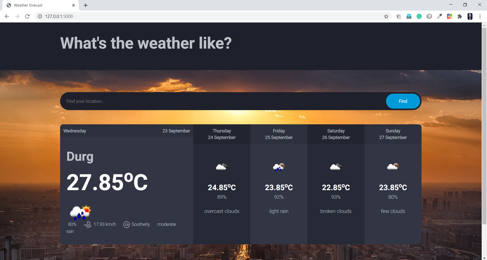
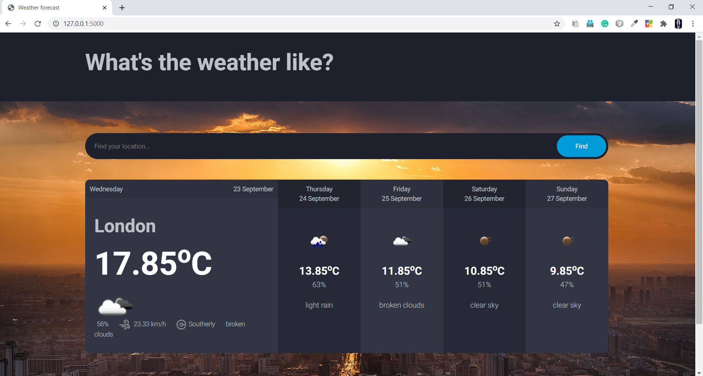

# Weather_App

This is a web-application based on <strong>Flask</strong> which follows guiding principles of <strong>REST</strong>. It basically tells the 5 day forecast of any City of any region in the world.

Below are the screenshots 
# Screenshots

 
 

